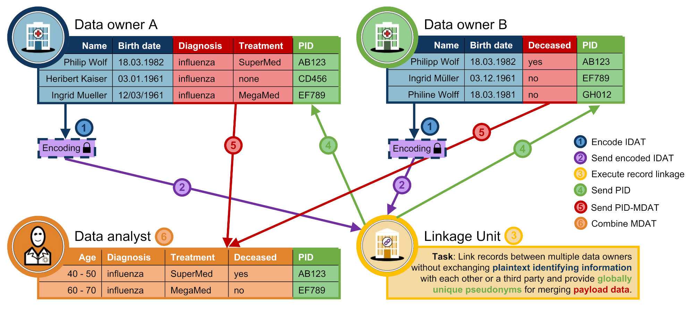

# PPRL services

## Background
Record linkage aims at linking records that refer to the same real-world entity,
such as persons. Typically, there is a lack of global identifiers, therefore the
linkage can only be achieved by comparing available quasi-identifiers, such as name,
address or date of birth. However, in many cases, data owners are only willing
or allowed to provide their data for such data integration if there is sufficient
protection of sensitive information to ensure the privacy of persons,
such as patients or customers.
**Privacy Preserving Record Linkage (PPRL)** addresses this problem by providing
techniques to match records while preserving their privacy allowing the combination
of data from different sources for improved data analysis and research.
For this purpose, the linkage of person-related records is based on encoded values
of the quasi-identifiers and the data needed for analysis (e.g., health data) is
separated from these quasi-identifiers. The relevant data can be provided to a
researcher without the identifying data.



The **data owner services** irreversibly transform the original plaintext to an encoded representation before
sharing this encoded data with a third party for linkage.
A popular encoding technique is based on Bloom filter data structures which is also the focus of this implementation.

The **linkage unit service** receives the encoded records and applies a matching algorithm
to determine entity clusters. The service supports multiple configurable classification models which allows
the execution of conventional plaintext linkage algorithms as well. Intermediate and final linkage
results including pairs are managed per project, separate from the records themselves, which allows
to efficiently test multiple linkage approaches on the same (encoded) dataset.

See also the [pprl-goodall repository](https://github.com/floroh/pprl-goodall) for more information on how to use these
services to run PPRL experiments.


## Modules
The project is structured in maven modules as follows:
- **common**: Shared data models and (analytical) utilities
- **data-generator**: Service for creating datasets based on synthetic generation or selection from existing
record clusters, see also our [respective paper](https://dbs.uni-leipzig.de/files/research/publications/2025-9/pdf/qdb2025_PPRL_published.pdf).
- **data-owner**: Service for encoding plaintext datasets. Includes also a corruption module to derive further linkage
problems under different data quality assumptions.
- **linkage-unit**: Service for matching encoded datastes.
- **protocol-manager**: Service that orchestrates the data flow between the other components.
- **pprl-core**: Core functionality for encoding, matching and dataset analytics

## Prerequisites
- Docker
- OR
  - Java 21
  - Maven

## Docker
Run services locally
(data owner: [localhost:8081](http://localhost:8081),
linkage unit [localhost:8082](http://localhost:8082),
protocol manager [localhost:8085](http://localhost:8085),
data generator unit [localhost:8086](http://localhost:8086)
)
with MongoDB in docker:
```bash
cp default.env .env
export DOCKER_BUILDKIT=1
export COMPOSE_DOCKER_CLI_BUILD=1
docker network create pprl-services-net
docker compose up
```
or after changes to the code:
```bash
docker compose up --build
```

Run only one service using docker, e.g., the data-owner:
```bash
docker compose up mongo pprl-do
```

## Data generation requirements
For usage of the data generation based on the North Carolina Voter Registry (NCVR),
the respective data must be provided either by:

### Importing it from the MongoDB database provided by [Panse et al.](https://doi.org/10.5441/002/edbt.2021.67)
- see also the [respective README](db/README.NCVR.md)
- adjust the datasets.usvr.connection-string in the data-generator application.yml
- Call the endpoint of the data generator service to parse and import the record clusters
```bash
curl --request POST \
  --url http://localhost:8086/selector/prepare/import-ncvr \
  --header 'content-type: application/json' \
  --data '{}'
```
### Direct import of the parsed record clusters
- Put the `ncvr_cluster.gz` (available on request) in the directory `db/dumps`
```bash
docker exec -it pprl-services-mongo /data/dumps/mongorestore.sh
```

## Dev
The vanilla repository does not contain application.yml that are 
needed for running the services, because they are frequently changed in development and are therefore 
included in the gitignore. However, the repositories contain application.yml.default files, that should 
work out-of-the-box and have to be copied/renamed and can be changed if needed.
```bash
cp data-owner/src/main/resources/application.yml.default data-owner/src/main/resources/application.yml
cp linkage-unit/src/main/resources/application.yml.default linkage-unit/src/main/resources/application.yml
cp protocol-manager/src/main/resources/application.yml.default protocol-manager/src/main/resources/application.yml
cp data-generator/src/main/resources/application.yml.default data-generator/src/main/resources/application.yml

cp data-owner/src/main/resources/application-mongo.yml.default data-owner/src/main/resources/application-mongo.yml
cp linkage-unit/src/main/resources/application-mongo.yml.default linkage-unit/src/main/resources/application-mongo.yml
cp protocol-manager/src/main/resources/application-mongo.yml.default protocol-manager/src/main/resources/application-mongo.yml
cp data-generator/src/main/resources/application-mongo.yml.default data-generator/src/main/resources/application-mongo.yml
```

To build and start the services run the following commands from the base directory of the project
```bash
mvn clean install -DskipTests
mvn -f data-owner spring-boot:run
mvn -f linkage-unit spring-boot:run
mvn -f protocol-manager spring-boot:run
mvn -f data-generator spring-boot:run
```

## Use
[Data Owner](data-owner/README.md)

[Linkage Unit](linkage-unit/README.md)